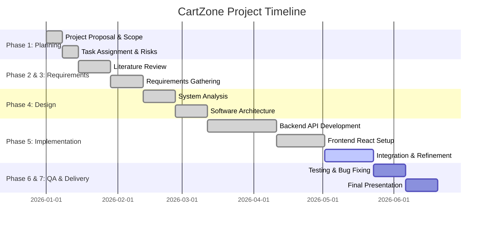

# Phase 1: Project Planning & Management

## 1. Project Plan & Timeline (Gantt Chart)

## 2. Task Assignment & Roles

| Role | Responsibilities | Assigned To |
|------|------------------|-------------|
| **Project Manager** | Oversees timeline, manages risks, ensures milestone delivery. | Mahmoud |
| **Backend Developer** | ASP.NET Core API development, Database Schema, Authentication. | Eslam / Mahmoud |
| **Frontend Developer** | React UI, Tailwind styling, Redux state management. | Mahmoud |
| **QA / Tester** | Creates test plans, executes test cases, bug tracking. | Team |
| **Documentation Lead**| Academic writing, UML diagrams, Presentation slides. | Team |

## 3. Risk Assessment & Mitigation Plan

| Risk ID | Risk Description | Probability | Impact | Mitigation Strategy |
|---------|------------------|-------------|--------|---------------------|
| **R01** | Scope Creep (Adding too many features like real-time chat). | High | High | Stick strictly to the Product Requirements Document (PRD). Delay extra features to v2. |
| **R02** | Stripe API Integration failure or key exposure. | Medium | High | Use environment variables for secrets. Thoroughly test Webhooks locally before deployment. |
| **R03** | Frontend/Backend connection issues (CORS / Authentication). | Low | High | Configure `AllowAll` CORS during development. Ensure JWT tokens are correctly attached to Axios interceptors. |
| **R04** | Time constraints before university deadline. | Medium | Critical | Prioritize core e-commerce flow (Login -> Cart -> Checkout). Secondary features (Wishlist, Reviews) can be mocked if necessary. |

## 4. Key Performance Indicators (KPIs)

- **Performance:** Frontend First Contentful Paint (FCP) under 1.5 seconds.
- **Reliability:** Backend API uptime of 99.9% during the grading period.
- **Code Quality:** Zero critical security vulnerabilities in `npm audit` and NuGet dependencies.
- **Usability:** 100% success rate for guest users completing the checkout flow during User Acceptance Testing.
