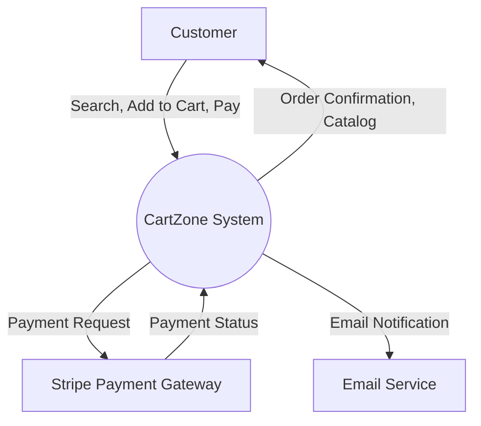
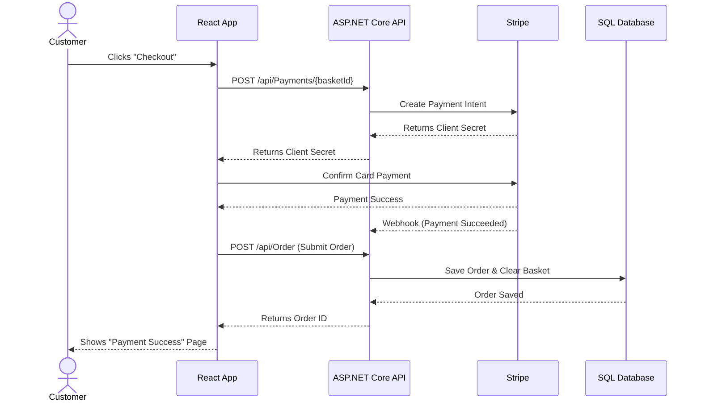
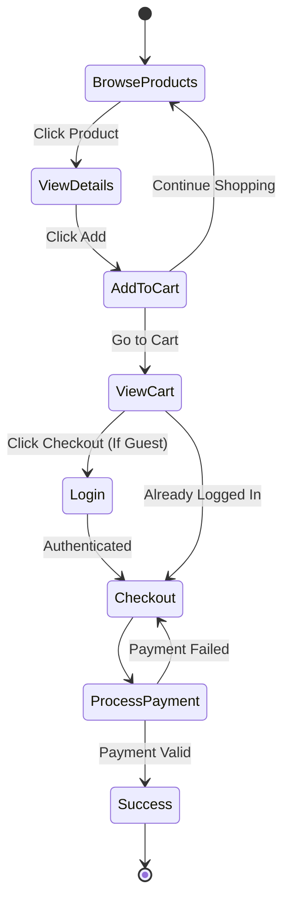
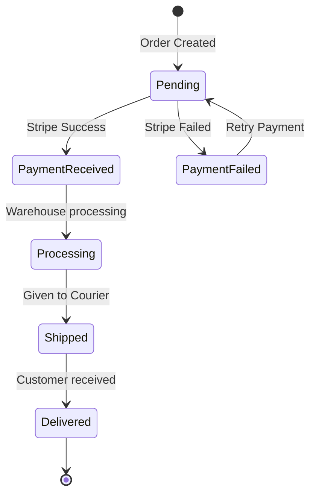
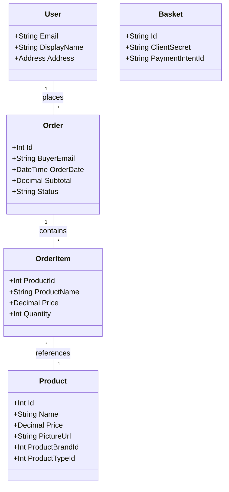

# Phase 4: System Analysis & Design (Academic Diagrams)

## 1. Use Case Diagram
This diagram shows how different actors interact with the CartZone system.

```mermaid
usecaseDiagram
    actor Guest
    actor Customer
    actor Admin

    package "CartZone System" {
        usecase "Browse Products" as UC1
        usecase "Search & Filter" as UC2
        usecase "Add to Cart" as UC3
        usecase "Register / Login" as UC4
        usecase "Manage Address" as UC5
        usecase "Checkout & Pay" as UC6
        usecase "Manage Products" as UC7
    }

    Guest --> UC1
    Guest --> UC2
    Guest --> UC3
    Guest --> UC4

    Customer --> UC1
    Customer --> UC2
    Customer --> UC3
    Customer --> UC4
    Customer --> UC5
    Customer --> UC6

    Admin --> UC7
```

## 2. Data Flow Diagram (DFD) - Level 0 Context
Shows the system boundary and external entities.



## 3. Sequence Diagram (Checkout Flow)
Shows the exact steps taken to complete an order.



## 4. Activity Diagram (Shopping Journey)
Shows the logical flow of a user navigating the site.



## 5. State Diagram (Order Lifecycle)
Shows the different states an Order can be in.



## 6. Class Diagram (Core Backend Domain)
Shows the entity relationships in C#.



## 7. Deployment Diagram
Shows the physical and cloud infrastructure.

```mermaid
graph TD
    subgraph Client Tier
        B[Browser / React App]
    end

    subgraph App Tier (Web Server)
        API[ASP.NET Core API - Port 7005]
    end

    subgraph Data Tier
        SQL[(SQL Server Database)]
        REDIS[(Redis Cache - Basket)]
    end

    subgraph External Services
        STRIPE[Stripe API]
    end

    B <-->|HTTP/HTTPS| API
    API <-->|EF Core / SQL| SQL
    API <-->|StackExchange.Redis| REDIS
    API <-->|REST API| STRIPE
```
