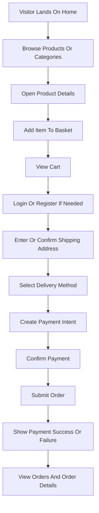

## 1. Product Overview
CartZone Frontend is a production-ready React storefront for the existing ASP.NET Core CartZone backend. It delivers a premium, responsive e-commerce experience with real API integration, JWT authentication, basket, checkout, and order flows.

- Main purpose: provide a complete customer-facing shopping experience over the existing CartZone API without mock data or fake endpoints
- Target users: retail shoppers browsing products, managing baskets, authenticating, placing orders, and tracking purchases
- Business value: turns the existing backend into a usable commercial storefront with scalable frontend architecture and maintainable UX foundations

## 2. Core Features

### 2.1 User Roles
| Role | Registration Method | Core Permissions |
|------|---------------------|------------------|
| Guest User | None | Browse catalog, search, filter, manage local basket, begin checkout |
| Authenticated Customer | Email registration/login | All guest capabilities plus profile, address management, orders, payment initiation, protected checkout |

### 2.2 Feature Module
1. **Home Page**: hero, featured products, categories grid, best sellers, new arrivals, promotions banner, newsletter section
2. **Products Page**: product grid, search, sorting, filters, pagination, loading and empty states
3. **Product Details Page**: gallery, product information, add to cart, related products, reviews UI shell
4. **Categories Page**: category discovery, category cards, linked product exploration
5. **Search Results Page**: keyword-driven product listing with contextual empty states
6. **Cart Page**: basket items, quantity update, remove item, summary, shipping estimate, coupon UI shell
7. **Wishlist Page**: client-managed wishlist with authenticated persistence-ready architecture
8. **Authentication Pages**: login, register, logout, session persistence, protected navigation
9. **User Profile Page**: profile summary, editable address, account shortcuts
10. **Orders Page**: order history list and status tracking
11. **Order Details Page**: order line items, totals, shipping and status details
12. **Checkout Page**: shipping address, delivery method, payment intent initiation, order summary
13. **Payment Result Pages**: payment success and payment failed outcomes
14. **System Pages**: not found page, error boundaries, skeletons, global notifications

### 2.3 Page Details
| Page Name | Module Name | Feature Description |
|-----------|-------------|---------------------|
| Home | Hero Section | Promotional hero with CTA to products and animated premium visual treatment |
| Home | Featured Products | Real products fetched from `/api/Products` with curated section presentation |
| Home | Categories Grid | Category cards sourced from product types endpoint and linked to filtered browsing |
| Home | Best Sellers | Reusable product rail using available product data and merchandising rules |
| Home | New Arrivals | Reusable product rail emphasizing latest visual content from catalog results |
| Home | Promotions Banner | Reusable marketing banner with route links and motion accents |
| Home | Newsletter Section | Email capture UI shell for future backend integration without fake submission logic |
| Products | Product Grid | Real catalog rendering using paginated API response |
| Products | Search and Sort | Query-state driven controls mapped to backend search and sort parameters |
| Products | Filters | Brand, category, and price/rating UI, with real backend integration for brand/type and client-side enhancement for unsupported filters |
| Products | Pagination | API-driven pagination using `pageIndex`, `pageSize`, `count`, and `data` |
| Product Details | Product Gallery | Image-led detail view using backend absolute picture URLs |
| Product Details | Add To Cart | Converts product details into basket item payload for `/api/Basket` |
| Product Details | Related Products | Contextual related catalog suggestions using available product data |
| Product Details | Reviews UI | Presentation-only review module shell for future backend support |
| Categories | Category Listing | Visual taxonomy page based on available product types |
| Search Results | Query Summary | Shows keyword context, result count, and fallback empty state |
| Cart | Basket Items | Reads and updates basket from Redis-backed basket API |
| Cart | Summary | Computes subtotal and integrates backend-provided shipping price when available |
| Cart | Coupon Area | UI shell only, clearly separated from unsupported backend functionality |
| Wishlist | Wishlist Grid | Client-side persisted wishlist with reusable product card actions |
| Login | Form | Zod + React Hook Form validation mapped to login DTO |
| Register | Form | DTO-aligned registration flow with validation and duplicate email checks |
| Profile | Address Management | Reads and updates authenticated address endpoints |
| Orders | Order History | Authenticated order list from `/api/Order` |
| Order Details | Order Breakdown | Authenticated order detail presentation |
| Checkout | Shipping Address | Reuses address DTO and profile address hydration |
| Checkout | Delivery Methods | Real delivery methods from `/api/Order/DeliveryMethods` |
| Checkout | Payment Method | Stripe-ready payment intent flow using `/api/Payments/{basketId}` client secret |
| Checkout | Order Summary | Basket, shipping, and total summary for conversion confidence |
| Payment Success | Confirmation | Order-oriented success state with CTA to orders |
| Payment Failed | Recovery | Failure explanation with retry path back to checkout |
| Not Found | Recovery Options | Route-safe recovery links to home and products |

## 3. Core Process
Guests arrive on the home page, explore categories or products, use filters and search, and add items to a persistent basket. Authentication unlocks address management, checkout, payment initiation, order placement, and account history.

Checkout uses the real backend sequence: update basket, select delivery method, create payment intent, confirm payment on the frontend, submit order, then navigate to success or failure states and refresh order history.

## 4. User Interface Design
### 4.1 Design Style
- Visual direction: premium editorial-commerce aesthetic combining luxury retail polish with marketplace clarity
- Primary colors: graphite black, porcelain white, warm sand, and controlled gold accents
- Accent palette: emerald for success states, amber for cart highlights, ruby for destructive actions
- Button style: softly rounded high-contrast buttons with crisp hover transitions and subtle scale feedback
- Typography: distinctive editorial display font for hero and section headlines paired with an elegant readable sans-serif for body content
- Layout style: desktop-first compositional grids with bold whitespace, modular cards, layered banners, and sticky shopping actions
- Icon style: refined line icons with minimal filled states for active commerce actions
- Motion style: smooth Framer Motion page transitions, staggered reveals, hover lift, and cart feedback micro-interactions
- Theme support: full light/dark theming with shared semantic tokens

### 4.2 Page Design Overview
| Page Name | Module Name | UI Elements |
|-----------|-------------|-------------|
| Home | Hero Section | Large editorial headline, layered imagery, CTA buttons, ambient gradients, staggered motion |
| Home | Product Rails | Premium cards, hover actions, wishlist affordance, skeleton placeholders |
| Products | Catalog Layout | Sticky filter rail, responsive toolbar, dense but readable product grid |
| Product Details | Purchase Panel | Gallery, price emphasis, metadata chips, sticky action block |
| Cart | Summary Layout | Split layout, quantity steppers, summary card, reassurance messaging |
| Auth | Forms | Minimal distraction, prominent validation, trust indicators, password visibility toggle |
| Profile | Account Shell | Sidebar tabs, editable cards, status badges, order summaries |
| Checkout | Step Layout | Progressive sections, radio cards, secure payment messaging, sticky totals |
| Payment Result | State Screen | Large iconography, clear messaging, primary recovery CTA |
| Not Found | Recovery Screen | Branded illustration, route shortcuts, soft motion accent |

### 4.3 Responsiveness
- Desktop-first design approach with mobile-adaptive behavior
- Collapsible filter drawer and bottom-sheet patterns on mobile
- Touch-friendly controls for quantity, form inputs, and action buttons
- Route and component layouts optimized for tablet breakpoints and narrow mobile screens
- Skeleton loading, empty states, and notification placement tuned per viewport

### 4.4 3D Scene Guidance
- Not applicable for the initial CartZone storefront implementation

## 5. Delivery Phases
### Phase 1
- Project setup with Vite, React 19, TypeScript, Tailwind CSS, Shadcn/UI, Redux Toolkit, RTK Query, React Router v7, Axios, React Hook Form, Zod, Framer Motion
- Frontend architecture, route definitions, app shell, store configuration, API layer, auth foundation
- Strongly typed DTO-based contracts and token persistence strategy

### Phase 2
- Home, products, product details, categories, search results, cart, wishlist
- Shared design system components, skeletons, empty states, error boundaries, dark mode

### Phase 3
- Profile, address management, orders, order details, checkout, payment result pages
- Final responsive polish, accessibility review, and performance optimization
