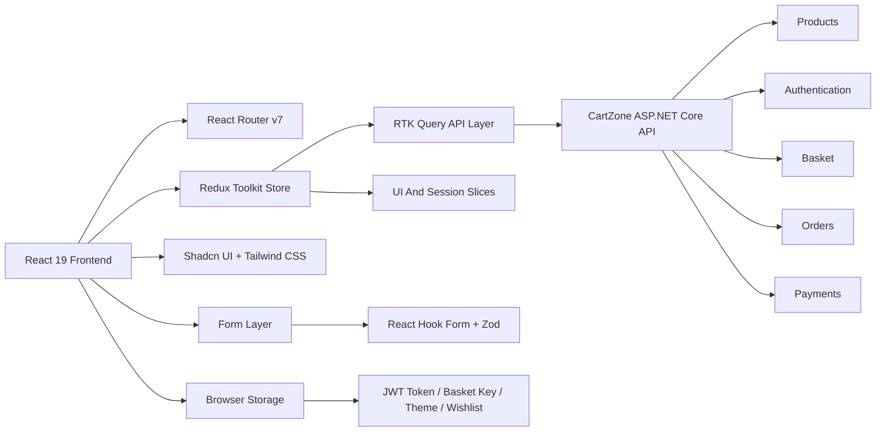
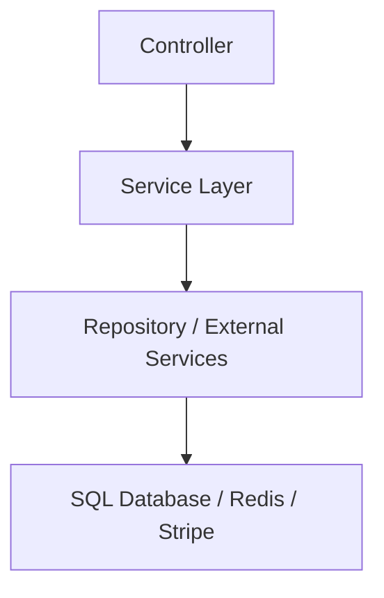
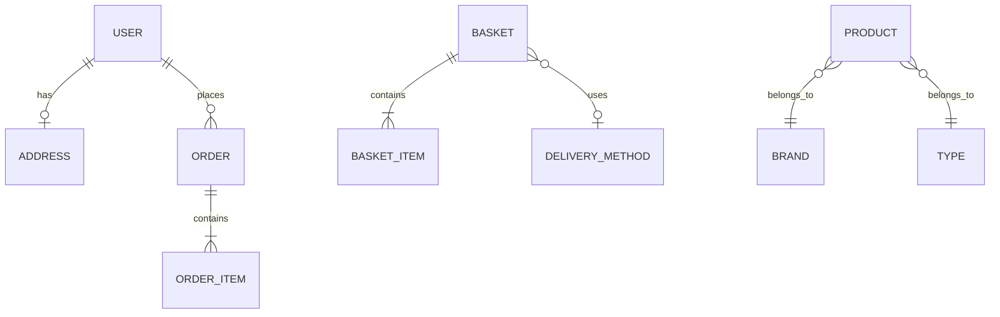

## 1. Architecture Design
CartZone Frontend is a client-rendered React application that consumes the existing ASP.NET Core backend over HTTP. State is split between server state handled by RTK Query and client/UI state handled by Redux Toolkit slices, forms, and local persistence.



## 2. Technology Description
- Frontend: React 19 + TypeScript + Vite
- Styling: Tailwind CSS + Shadcn/UI + CSS variables for theme tokens
- Routing: React Router v7 with lazy-loaded route modules
- State Management: Redux Toolkit
- Server State: RTK Query as the primary API caching layer
- HTTP Utilities: Axios for custom interceptors, token injection, and non-RTK utility requests where needed
- Forms: React Hook Form + Zod
- Animation: Framer Motion
- Optional Async Utilities: React Query only if a non-RTK Query integration gap appears; not planned in phase 1
- Backend: Existing ASP.NET Core CartZone API
- Payments: Stripe client-side confirmation using backend-issued `clientSecret`
- Persistence: localStorage for JWT token, theme preference, guest basket key, and wishlist
- Initialization Tool: Vite

## 3. Route Definitions
| Route | Purpose |
|-------|---------|
| / | Home page with hero, merchandising, and discovery sections |
| /products | Catalog listing with search, filters, sorting, and pagination |
| /products/:id | Product details page |
| /categories | Category discovery page |
| /search | Search results page driven by query params |
| /cart | Basket management page |
| /wishlist | Wishlist page |
| /login | Customer login page |
| /register | Customer registration page |
| /profile | Protected user profile and address page |
| /orders | Protected order history page |
| /orders/:id | Protected order details page |
| /checkout | Protected checkout flow |
| /payment/success | Payment success state |
| /payment/failed | Payment failure state |
| * | Not found page |

## 4. API Definitions
### 4.1 Core TypeScript Contracts
```ts
export interface PaginatedResult<T> {
  pageIndex: number;
  pageSize: number;
  count: number;
  data: T[];
}

export interface ProductDto {
  id: number;
  name: string;
  description: string;
  pictureUrl: string;
  price: number;
  productBrand: string;
  productType: string;
}

export interface BrandDto {
  id: number;
  name: string;
}

export interface TypeDto {
  id: number;
  name: string;
}

export interface BasketItemDto {
  id: number;
  productName: string;
  pictureUrl: string;
  price: number;
  quantity: number;
}

export interface BasketDto {
  id: string;
  items: BasketItemDto[];
  clientSecret?: string | null;
  paymentIntentId?: string | null;
  deliveryMethodId?: number | null;
  shippingPrice?: number | null;
}

export interface LoginDto {
  email: string;
  password: string;
}

export interface RegisterDto {
  email: string;
  password: string;
  userName?: string;
  displayName: string;
  phoneNumber?: string;
}

export interface UserDto {
  email: string;
  token: string;
  displayName: string;
}

export interface AddressDto {
  firstName: string;
  lastName: string;
  street: string;
  city: string;
  country: string;
}

export interface DeliveryMethodDto {
  id: number;
  shortName: string;
  description: string;
  deliveryTime: string;
  cost: number;
}

export interface OrderItemDto {
  productId: number;
  productName: string;
  pictureUrl: string;
  price: number;
  quantity: number;
}

export interface OrderToReturnDto {
  buyerEmail: string;
  shipToAddress: AddressDto;
  deliveryMethod: string;
  items: OrderItemDto[];
  status: string;
  id: number;
  orderDate: string;
  subTotal: number;
  total: number;
}

export interface OrderDto {
  basketId: string;
  deliveryMethodId: number;
  shipToAddress: AddressDto;
}

export interface ValidationError {
  field: string;
  errors: string[];
}

export interface ValidationErrorToReturn {
  statusCode: number;
  message?: string;
  validationErrors: ValidationError[];
}

export interface ErrorToReturn {
  statusCode: number;
  errorMessage?: string;
  errors?: string[];
}
```

### 4.2 Endpoint Contracts
| Method | Route | Auth | Request | Response |
|--------|-------|------|---------|----------|
| GET | /api/Products | No | Query: `brandId`, `typeId`, `sort`, `search`, `pageIndex`, `pageSize` | `PaginatedResult<ProductDto>` |
| GET | /api/Products/:id | No | Path: `id` | `ProductDto` |
| GET | /api/Products/brands | No | None | `BrandDto[]` |
| GET | /api/Products/types | No | None | `TypeDto[]` |
| GET | /api/Basket?key={id} | No | Basket key | `BasketDto` |
| POST | /api/Basket | No | `BasketDto` | `BasketDto` |
| DELETE | /api/Basket?key={id} | No | Basket key | `boolean` |
| POST | /api/Authentication/Login | No | `LoginDto` | `UserDto` |
| POST | /api/Authentication/Register | No | `RegisterDto` | `UserDto` |
| GET | /api/Authentication/CheckEmail?email={email} | No | Email query | `boolean` |
| GET | /api/Authentication/CurrentUser | Yes | Bearer token | `UserDto` |
| GET | /api/Authentication/Address | Yes | Bearer token | `AddressDto` |
| PUT | /api/Authentication/Address | Yes | `AddressDto` | `AddressDto` |
| GET | /api/Order/DeliveryMethods | No | None | `DeliveryMethodDto[]` |
| POST | /api/Order | Yes | `OrderDto` | `OrderToReturnDto` |
| GET | /api/Order | Yes | None | `OrderToReturnDto[]` |
| GET | /api/Order/:id | Yes | Path: `id` | `OrderToReturnDto` |
| POST | /api/Payments/:basketId | Yes | Path: `basketId` | `BasketDto` |
| POST | /api/Payments/webhook | Stripe | Raw webhook body | `Empty / webhook acknowledgment` |

### 4.3 Query and Sort Rules
- `pageIndex` default: `1`
- `pageSize` default: `5`
- `pageSize` max accepted by backend: `10`
- sort values:
  - `1`: Name ascending
  - `2`: Name descending
  - `3`: Price ascending
  - `4`: Price descending

### 4.4 Client Integration Rules
- Use `Authorization: Bearer <token>` for authenticated endpoints
- Store `basket.id` locally for guest continuity
- Always update basket before creating payment intent
- `deliveryMethodId` must be present in basket before calling `/api/Payments/{basketId}`
- `paymentIntentId` must exist before placing an order
- Backend returns absolute image URLs through mapping profiles; frontend should consume them directly

## 5. Server Architecture Diagram
The backend already exists and should be treated as a stable external application boundary for the frontend.



## 6. Data Model
### 6.1 Frontend Domain Model


### 6.2 Frontend State Definition
- **Auth State**
  - `user: UserDto | null`
  - `token: string | null`
  - `status: "idle" | "loading" | "authenticated" | "anonymous"`
- **Basket State**
  - `basketKey: string | null`
  - `basket: BasketDto | null`
- **UI State**
  - `theme: "light" | "dark" | "system"`
  - `mobileNavOpen: boolean`
  - `filtersDrawerOpen: boolean`
  - `toasts: managed by UI provider`
- **Wishlist State**
  - `items: ProductDto[]`
  - persisted locally in phase 1 architecture for immediate UX support

## 7. Frontend Folder Architecture
```text
src/
├── app/
├── layouts/
├── pages/
├── features/
├── services/
├── hooks/
├── store/
├── routes/
├── types/
├── utils/
├── components/
├── assets/
└── constants/
```

### 7.1 Layer Responsibilities
- `app/`: app bootstrap, providers, theme, error boundary wiring
- `layouts/`: shared shells like storefront layout, auth layout, profile layout
- `pages/`: route-level pages only
- `features/`: feature modules such as auth, products, basket, checkout, orders, wishlist
- `services/`: API client, interceptors, RTK Query services, storage adapters
- `hooks/`: reusable hooks for auth guards, basket key, media queries, theme, debouncing
- `store/`: Redux store, slices, middleware, typed hooks
- `routes/`: route objects, lazy loading, protected route helpers
- `types/`: DTOs, API contracts, view models, utility types
- `utils/`: pure helpers, formatters, query param mappers, error parsers
- `components/`: shared UI and commerce components
- `constants/`: route constants, storage keys, API constants, sort/filter mappings

## 8. Phase 1 Implementation Scope
- Initialize Vite React TypeScript project
- Configure Tailwind CSS and Shadcn/UI
- Add Redux Toolkit store and RTK Query base API
- Add Axios client with auth header support and centralized error mapping
- Implement route structure and lazy page boundaries
- Implement auth feature with login, register, session hydration, protected routes
- Implement DTO-based type layer from the real backend contracts
- Implement app shell, header, footer, theme, notifications, and error boundaries

## 9. Non-Functional Requirements
- Strict TypeScript configuration
- No mock data or fake endpoints
- Mobile-first interaction quality within a desktop-first visual system
- Accessible form labels, keyboard navigation, contrast-safe states, and semantic landmarks
- Route-level code splitting and component memoization where justified
- Skeletons and empty states for all network-heavy views
- Clear recovery paths for auth expiration, missing basket, failed payment, and no-result searches
